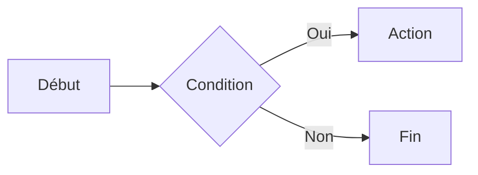

# Cheat Sheet Markdown

Aide-mémoire de la syntaxe Markdown (CommonMark + extensions GitHub courantes).

---

## 1. Titres

```markdown
# Titre niveau 1
## Titre niveau 2
### Titre niveau 3
#### Titre niveau 4
##### Titre niveau 5
###### Titre niveau 6
```

Alternative pour les niveaux 1 et 2 :

```markdown
Titre niveau 1
==============

Titre niveau 2
--------------
```

---

## 2. Mise en forme du texte

| Syntaxe | Résultat |
|---|---|
| `**gras**` ou `__gras__` | **gras** |
| `*italique*` ou `_italique_` | *italique* |
| `***gras et italique***` | ***gras et italique*** |
| `~~barré~~` | ~~barré~~ |
| `` `code en ligne` `` | `code en ligne` |
| `==surligné==` (selon l'éditeur) | ==surligné== |
| `H~2~O` / `X^2^` (selon l'éditeur) | indice / exposant |

Pour échapper un caractère spécial, utiliser `\` : `\*pas italique\*`

---

## 3. Paragraphes et retours à la ligne

- Un **paragraphe** est séparé du suivant par une **ligne vide**.
- Pour un **retour à la ligne** simple : terminer la ligne par **deux espaces** ou par un `\`.

```markdown
Première ligne  
Deuxième ligne
```

---

## 4. Listes

### Non ordonnée

```markdown
- Élément
- Élément
  - Sous-élément (indenter de 2 ou 4 espaces)
  - Sous-élément
* On peut aussi utiliser *
+ ou +
```

### Ordonnée

```markdown
1. Premier
2. Deuxième
   1. Sous-élément
3. Troisième
```

### Liste de tâches (GitHub)

```markdown
- [x] Tâche terminée
- [ ] Tâche à faire
```

---

## 5. Liens

```markdown
[Texte du lien](https://exemple.com)
[Lien avec titre](https://exemple.com "Titre au survol")
<https://exemple.com>
[Lien par référence][ref]

[ref]: https://exemple.com "Titre optionnel"
```

Liens internes (ancres) :

```markdown
[Aller à la section Listes](#4-listes)
```

---

## 6. Images

```markdown


```

Image cliquable :

```markdown
[](https://exemple.com)
```

---

## 7. Citations

```markdown
> Ceci est une citation.
> Sur plusieurs lignes.
>
> > Citation imbriquée.
```

---

## 8. Code

### En ligne

```markdown
Utilise la commande `git status`.
```

### Bloc de code avec coloration syntaxique

~~~markdown
```python
def bonjour(nom):
    return f"Bonjour {nom} !"
```
~~~

Langages courants : `python`, `javascript`, `bash`, `json`, `html`, `css`, `sql`, `yaml`, `diff`.

### Bloc indenté

Indenter de **4 espaces** (ou une tabulation) :

```markdown
    ceci est du code
```

---

## 9. Tableaux

```markdown
| Nom   | Âge | Ville  |
|-------|:---:|-------:|
| Alice |  30 | Paris  |
| Bob   |  25 | Lyon   |
```

Alignement des colonnes :

| Syntaxe | Alignement |
|---|---|
| `:---` | à gauche |
| `:---:` | centré |
| `---:` | à droite |

---

## 10. Séparateur horizontal

```markdown
---
***
___
```

---

## 11. Notes de bas de page

```markdown
Voici une phrase avec une note.[^1]

[^1]: Ceci est le contenu de la note.
```

---

## 12. HTML dans Markdown

La plupart des moteurs acceptent le HTML brut :

```markdown
<details>
<summary>Cliquer pour dérouler</summary>

Contenu caché.

</details>

Texte avec <kbd>Ctrl</kbd> + <kbd>C</kbd> et <br> saut de ligne.
```

---

## 13. Commentaires

```markdown
<!-- Ce commentaire n'apparaît pas dans le rendu -->
```

---

## 14. Extensions fréquentes

### Alertes GitHub

```markdown
> [!NOTE]
> Information utile.

> [!TIP]
> Astuce.

> [!IMPORTANT]
> Information essentielle.

> [!WARNING]
> Attention.

> [!CAUTION]
> Risque de conséquences négatives.
```

### Diagrammes Mermaid

~~~markdown

~~~

### Formules mathématiques (LaTeX)

```markdown
En ligne : $E = mc^2$

Bloc :
$$
\sum_{i=1}^{n} i = \frac{n(n+1)}{2}
$$
```

### Emojis

```markdown
:smile: :rocket: :warning:
```

---

## 15. Bonnes pratiques

- Laisser une **ligne vide** avant et après les titres, listes, blocs de code et tableaux.
- Ne pas sauter de niveaux de titres (`#` puis `###`).
- Toujours renseigner le **texte alternatif** des images.
- Préférer des **liens descriptifs** à « cliquez ici ».
- Rester cohérent : un seul style pour les listes (`-`) et le gras (`**`).
- Le rendu peut varier selon la plateforme (GitHub, GitLab, Obsidian, Notion, VS Code…) : tester au besoin.

---

## Aide-mémoire ultra-rapide

| Je veux… | J'écris… |
|---|---|
| Un titre | `# Titre` |
| Du gras | `**texte**` |
| De l'italique | `*texte*` |
| Un lien | `[texte](url)` |
| Une image | `` |
| Une liste | `- élément` |
| Une liste numérotée | `1. élément` |
| Une citation | `> texte` |
| Du code | `` `code` `` |
| Un bloc de code | ` ``` ` |
| Une ligne de séparation | `---` |
| Une case à cocher | `- [ ] tâche` |